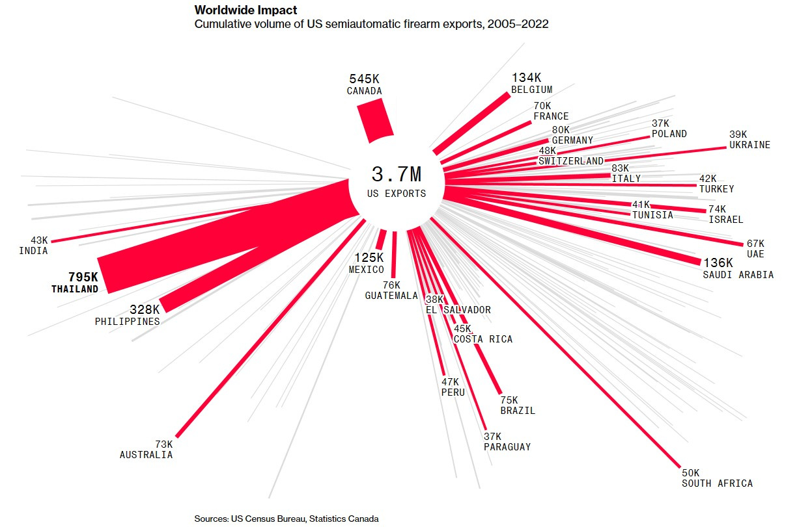
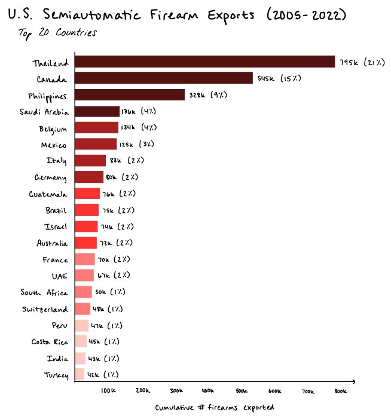
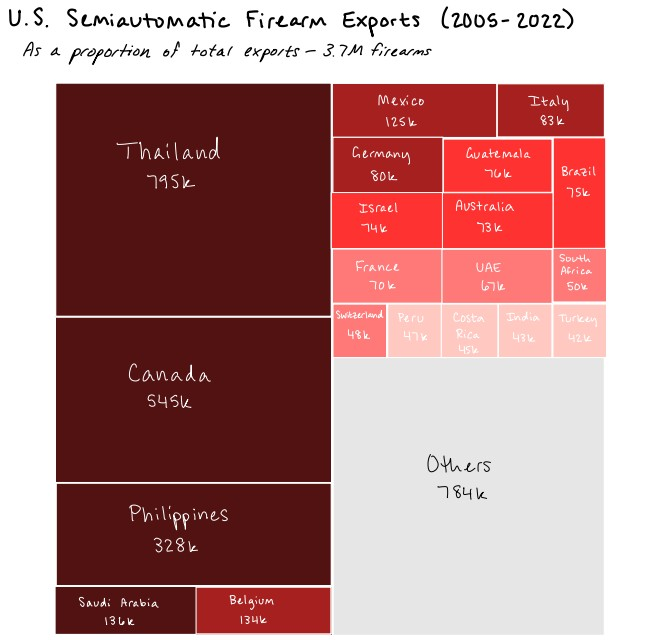
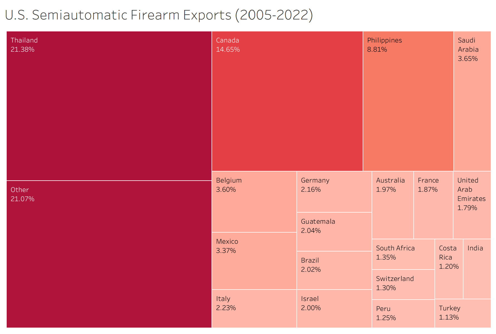

| [Home](https://anna-ringwood.github.io/fa25-dataviz-portfolio/) | [Data Viz Examples](dataviz-examples) | [Critique by Design](critique-by-design) | [Final Project I](final-project-part-one) | [Final Project II](final-project-part-two) | [Final Project III](final-project-part-three) |

# Critique by Design: U.S. Gun Exports

The goal of this assignment is to select a visualization that has already been created, critique its strengths and weaknesses, and redesign it in an attempt to address the identified weaknesses. The steps below outline the process from selecting the visualization to creating and refining the redesign, with some insights into my thought processes along the way.

## Step One: The Visualization

The visualization I chose to redesign is shown below. This one stood out to me due to its unique arrangement, but my initial thoughts were that the overall message is clouded by the chaos of the radial lines. A more in-depth critique is in Step Two.

Visualization source: Riley et al., "Mass US-Made Gun Exports Are Fueling Violence, Shootings Globally."

Data source: "US Domestic Manufactured Semiautomatic Gun Exports 2005-2022.Csv."

## Step Two: The Critique

**_First glance:_** The bright red color of some of the bars stood out to me immediately, as did the different lengths of the bars and their unique circular orientation. The simplicity of the visualization is its strongest point, in that there aren’t a lot of unnecessary elements (except, perhaps, the gray bars), but it is almost too simple. For example, I first noticed the “3.7M US Exports” text in the center of the visualization, but with the title being so small at the top (and not very descriptive), I didn’t immediately understand what the 3.7M count was referencing. I also wasn't sure what the grayed-out bars represent because there are no labels or even a legend. The different thicknesses and lengths of the bars were also difficult to parse for meaning: I first noticed South Africa due to the length of its bar, but its export total is only 6% of Thailand’s, which I would think would be the main focus of the visualization. Finally, the orientation of the bars around the center circle makes little sense to me– Canada is all by itself at around 11 o’clock, whereas most of the other countries are concentrated around 2-4 o’clock and 7-9 o’clock. Upon further inspection, the bars do seem to be ordered somewhat by continent, but that was not immediately apparent to me.

**_Intended audience:_** Based on the website (Bloomberg, a news site) and language of the accompanying article, the primary audience appears to be lay readers. The visualization, with its unique shape and bright color, is effective insofar as it would compel a viewer to look at it, but its message is not easily discernable. I would imagine that others, like me, would be drawn towards the center first and then the extremes of the visualization, but you would have to stare at it for a while to understand both what the bars represent and which bars represent more extreme data points. In a world that is already so fast-paced when it comes to digital content consumption, I doubt that people would spend more than a few seconds looking at this visualization, and I’m not sure they would come away with the right message.

**_Redesign focus:_** With these critiques in mind, I mainly want to focus on rearranging the data for better comparison across countries and in relation to the total export number. I think this visualization would be more effective as a  bar chart, or potentially a treemap or unit chart. I’m a little hesitant on using treemap/unit chart because they would be relying on people’s perception of areas (which can be misleading), but I’d still like to try one or both of them. I also want to focus on providing more context for the viewer, such as having a more descriptive title and ordering the countries more logically so that the number of exports to Thailand is highlighted (which seems to be the intended focus of the visualization given the country name’s bolded text). I am excited to see if I can use color a bit more judiciously to again call attention to the higher-export countries, but I do think I will keep the eye-catching bright red color as a starting point.

## Step Three, Part One: Sketch a Solution

Below are my initial sketches based on my observations from step two.

| Bar Chart | Treemap |
|----------|-------------|
|||

## Step Four, Part One: Test the Solution

For this part, I asked some classmates to review my two options. Their feedback is below.

**Bar Chart Results:**

| Question | Interview (three M.S. students at CMU, collectively) |
|----------|-------------|
|**What is confusing or what don't you like about this graph?**|The percentages don't mean much without more context; colors could be more intentional, perhaps graying out lower-ranked countries|

**Treemap Results:**

|Question|Interview (three M.S. students at CMU, collectively)|
|----------|-------------|
|**What is confusing or what don't you like about this graph?**|Having the percentages on the blocks instead of numbers would be more intuitive, since they represent parts of a whole; countries that aren't quite the same (when going by raw counts) look like they have the same exports when going by area|

**Both visualizations:** could aggregate by continent

## Step Three, Part Two: Sketch a Solution

I incorporated the feedback about the numbers vs. percentages from my classmates to create a new set of sketches:

| Bar Chart | Treemap |
|----------|-------------|
|||

## Step Four, Part Two: Test the Solution

For this part, I asked some people who are less data-savvy (excluding the AP Stats teacher) to review my two options. Their feedback from my interviews (~10 minutes each) is below. The males were given the bar chart first to look at, then the treemap. The females saw the treemap first, then the bar chart. (Admittedly, it's not the best randomization strategy, but I didn't think to roll a die or flip a coin before showing my sketches.)

**Bar Chart Results:**

| Question |Interview 1 (late-50s male, music librarian)|Interview 2 (early-50s female, AP Statistics teacher)|Interview 3 (early-20s female, undergraduate junior)|Interview 4 (early-20s male, engineer)|
|----------|-------------|-------------|-------------|-------------|
|**What do you think this graph is trying to show you?**|"To which countries the U.S. has exported semi-automatic firearms, and they are ranked in descending order."|*Did not provide a direct answer*|*Did not provide a direct answer*|"I see Thailand is purchasing a bunch of firearms."|
|**What is confusing or what would you change about this graph?**|What do the different colors mean? They do reinforce the descending nature of the data, but one would expect to see a legend defining the colors.|Use of "cumulative" in the x-axis label makes it sound like the countries should be added together|Liked the numbers over the percents|Colors seem unnecessary, but he could see how it might depend on the audience|
|**Other thoughts?**|Liked the counts placed at the ends of the bars|Colors didn't bother her as much (relative to treemap) because they are colored by quintile|Preferred this one to the treemap|"Font" is not ideal; "Bar graph is simpler."|

**Treemap Results:**

| Question |Interview 1 (late-50s male, music librarian)|Interview 2 (early-50s female, AP Statistics teacher)|Interview 3 (early-20s female, undergraduate junior)|Interview 4 (early-20s male, engineer)|
|----------|-------------|-------------|-------------|-------------|
|**What do you think this graph is trying to show you?**|Not entirely sure what he was supposed to take away from it|"We're sending most of our firearms to Thailand, Canada, and the Philippines."|"Who the U.S. exports our firearms to"|*Did not provide a direct answer*|
|**What is confusing or what would you change about this graph?**|Brazil's rectangle is the only 2% one that is vertically-oriented|Why are blocks of the same size different colors? Subtitle is also confusing, makes it seem like 21% of total U.S. exports to Thailand are firearms|Percents are harder to interpret in terms of trying to relate them to quantities; was unfamiliar with this type of viz and thus didn't like it|Was unfamiliar with this type of viz and thus didn't like it|
|**Other thoughts?**|Not easily viewed on a small (i.e., phone) screen|Two-column format is distracting; let the top three countries occupy the full width of the space|*None*|Thailand number seems less significant now that it's contextualized by the "Others" category|

**Synthesis:**

Below I synthesize the comments made by all seven interviewees:
* Most of the interviewees understood the purpose of both the bar chart and the treemap without needing my explanation, which solidified my confidence in the broad organization of both sketches. There were additional comments made on more specific elements of each sketch, however.
* Respondents generally found the treemap to be more difficult to read, which I attribute to treemaps being relatively uncommon visualizations (and it is also difficult to sketch an accurate treemap by hand).
* Several comments were made concerning the colors used in both the bar chart and the tree map: some were confused by the colors, while others didn't mind them. The general consensus was that the different colors didn't provide enough benefit to warrant their use, so I will need to revisit my color decisions in the final design.
* Interestingly, both of the male lay interviewees mentioned a dislike of the "font" used in the sketches. Upon understanding that it was my own handwriting, they retracted their opinions, but their initial comments highlighted to me the importance of choosing a readable, professional font for the final design.
* The most helpful critique was the lay engineer's identification that the bar chart and treemap depicted two different data scenarios via the inclusion of the "Others" category in the latter sketch. With the treemap, my goal was to better represent the "proportion" aspect of the original visualization, but I hadn't realized that a similar representation was missing from the bar chart.

Overall, people seemed to have more positive feedback regarding the bar chart than the treemap. Thus, I moved forward with the bar chart with the goal of prioritizing intentional color use and trying to see if I could somehow incorporate the "3.7M total firearm exports" for additional context.

## Step Five: Build the Solution

I was inspired by my classmates' comments about potentially leveraging the continents, and although I didn't aggregate across continents like they suggested, I did think it might be helpful to color the countries' bars based on continent (thus satisfying my goal of using color intentionally). To do this, I augmented the original data set (augmented version is [here](USGunExports.csv)) with the continents for each of the top 20 countries.

I did try to meet my second goal of incorporating the 3.7M total number to provide context, but my attempts (shown as static images below) resulted in visualizations that I considered to either be too complex or not intuitive. (Given more time, I would have liked to show the revised images to others for their feedback.)

**Bar chart attempt:**

Here, the reference line simply made the visualization too wide, thus distracting from the overall message of export quantity to Thailand.

**Treemap attempt:**

In this attempt, I could not increase the font size of the text on the tiles (likely due to space issues in the smaller tiles), which made the visualization text harder to read. Further, the Thailand and Other tiles are competing for the viewer's attention, obscuring the overall message about the quantity of exports to Thailand.

At last, we arrive at the final solution below.

<noscript></noscript><object class='tableauViz'  style='display:none;'><param name='host_url' value='https%3A%2F%2Fpublic.tableau.com%2F' /> <param name='embed_code_version' value='3' /> <param name='site_root' value='' /><param name='name' value='CritiqueByDesignFinal&#47;BarChart' /><param name='tabs' value='no' /><param name='toolbar' value='yes' /><param name='static_image' value='https:&#47;&#47;public.tableau.com&#47;static&#47;images&#47;Cr&#47;CritiqueByDesignFinal&#47;BarChart&#47;1.png' /> <param name='animate_transition' value='yes' /><param name='display_static_image' value='yes' /><param name='display_spinner' value='yes' /><param name='display_overlay' value='yes' /><param name='display_count' value='yes' /><param name='language' value='en-US' /><param name='filter' value='publish=yes' /></object>

---

In conclusion, I found this process very insightful. In selecting the original visualization to redesign (step one), I saw a number of different visualization types and critically considered their potential for use in this exercise. In critiquing the selected visualization (step two), I learned about two evaluation frameworks (from _Good Charts_ and the Data Visualization Effectiveness Profile) and applied them to an existing visualization. In sketching my own solutions (step three), I gained a better understanding of the specific choices that must go into creating a visualization (e.g., color, size, shape, white space, etc.). In interviewing others for feedback (step four), I was exposed to the wide range of ways in which people consume and interpret visual information. Finally, in creating my own solution (step five), I gained experience in synthesizing my own learning and external sources to present one cohesive final product. This exercise has ultimately equipped me with the tools and cognitive processes I need to carefully design and review visualizations going forward.

## References
* Michael Riley et al., "Mass US-Made Gun Exports Are Fueling Violence, Shootings Globally," Bloomberg, July 24, 2023, [https://www.bloomberg.com/graphics/2023-us-made-gun-exports-shootings-violence-sig-sauer/](https://www.bloomberg.com/graphics/2023-us-made-gun-exports-shootings-violence-sig-sauer/).
* Scott Berinato, *Good Charts: The HBR Guide to Making Smarter, More Persuasive Data Visualizations* (Harvard Business School Publishing Corporation, 2023).
* Stephen Few. "Data Visualization Effectiveness Profile." *Visual Business Intelligence Newsletter,* March 2017. [https://www.perceptualedge.com/articles/visual_business_intelligence/data_visualization_effectiveness_profile.pdf](https://www.perceptualedge.com/articles/visual_business_intelligence/data_visualization_effectiveness_profile.pdf)
* "US Domestic Manufactured Semiautomatic Gun Exports 2005-2022," May 12, 2024, [https://data.world/makeovermonday/2024w20-us-made-gun-exports-2005-2022/workspace/file?filename=US+Domestic+Manufactured+Semiautomatic+Gun+Exports+2005-2022.csv](https://data.world/makeovermonday/2024w20-us-made-gun-exports-2005-2022/workspace/file?filename=US+Domestic+Manufactured+Semiautomatic+Gun+Exports+2005-2022.csv).

## AI Acknowledgements
AI was used briefly to help me with some more advanced Tableau features as I experimented with my later attempts (e.g., adding a reference line to the bar chart and aggregating the non-top-20 countries into an "Others" category).

