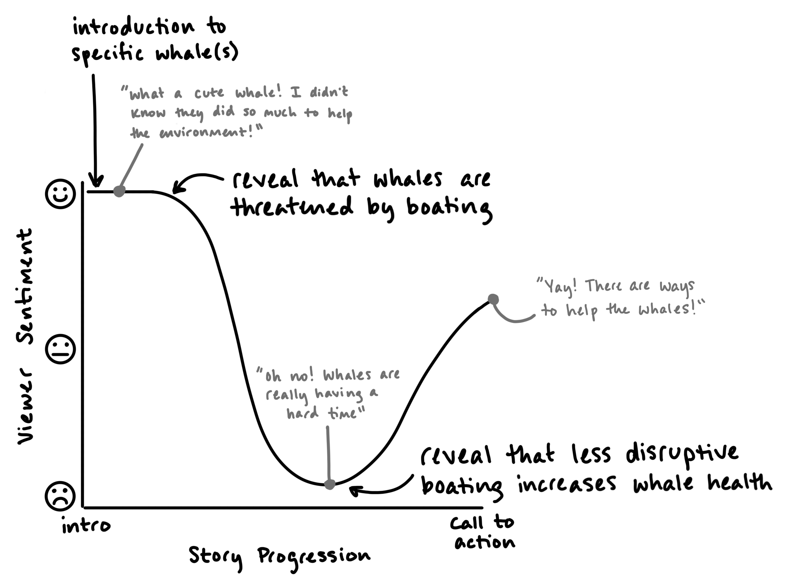
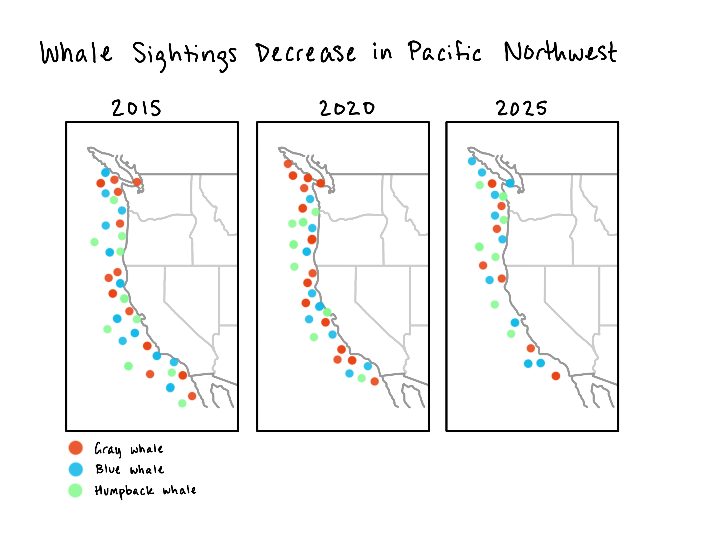
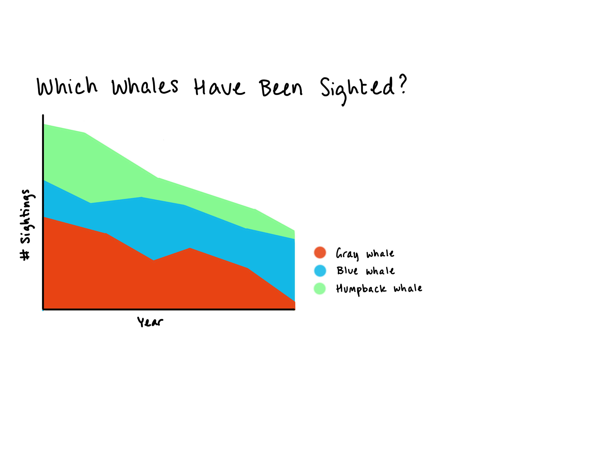
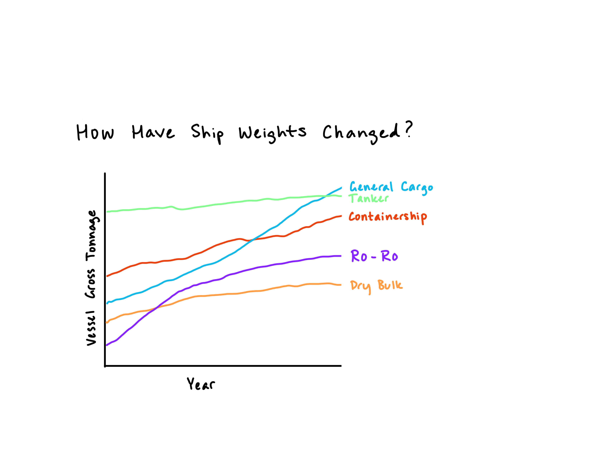
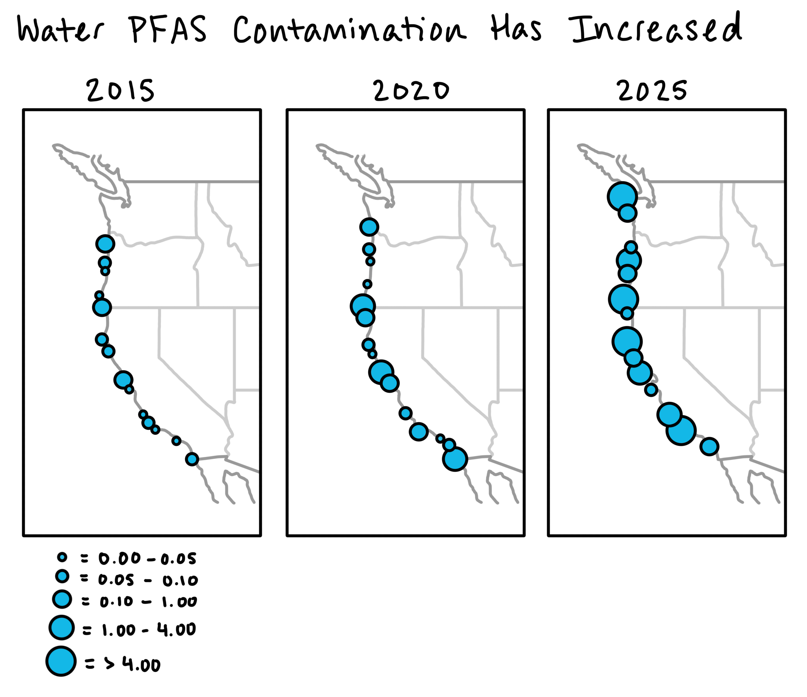
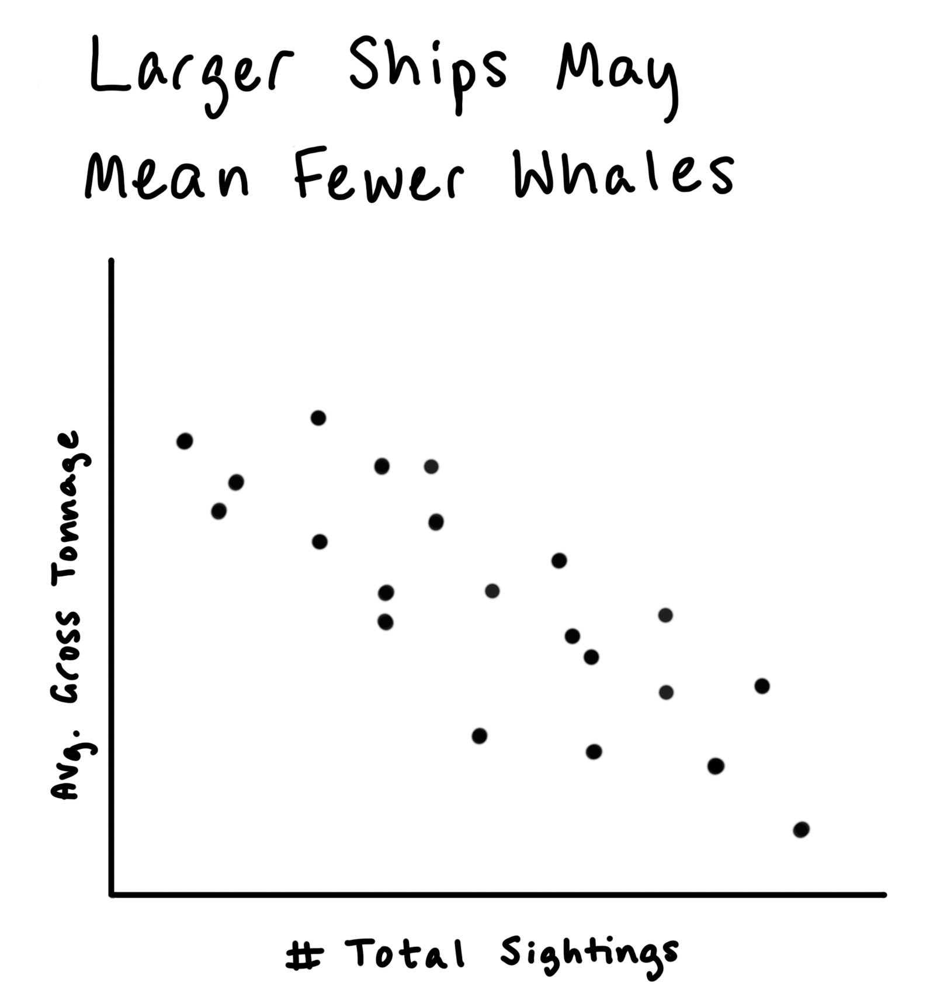

| [Home](https://anna-ringwood.github.io/fa25-dataviz-portfolio/) | [Data Viz Examples](dataviz-examples) | [Critique by Design](critique-by-design) | [Final Project I](final-project-part-one) | [Final Project II](final-project-part-two) | [Final Project III](final-project-part-three) |

# Outline

Whales contribute greatly to protecting our planet! By storing carbon in their large bodies, they prevent it from returning to the atmosphere as carbon dioxide [1]. Even after they die, their remains sink to the bottom of the ocean where they provide nutrients for deep-sea life [2]. However, harmful human behavior like whaling, boat traffic, and pollution can endanger these majestic, gentle giants [3]. Although commercial whaling officially stopped in the U.S. in 1972 [4], we continue to encroach upon the territory of whales, leading to injuries, undue stress, early deaths, and shrinking populations for these creatures.

This project explores the relations between human behaviors (or their proxies) and the frequency of whale sightings along the U.S. coast. The goal is to uncover patterns that show how changes in maritime practices have influenced the whale population over time, ultimately instilling in the viewer a sense of appreciation for whales and a responsibility to protect their habitat.

With my story, I hope to evoke from the viewer feelings of gratitude and awe towards whales and the desire to advocate for protecting these animals and their environment. The major elements of my story will likely be:

* Setup: Spotlight on a specific whale or whales that has/have been sighted regularly over the years. Highlight the benefits of whales for the environment.
* Conflict: However, modern-day ocean pollution continues to create stress for whales, and their populations are suffering.
* Resolution: Reduced boat traffic has positive effects on whales, so everyone should support efforts to amend maritime regulations in a way that conserves the environment for whales.

One-sentence summary: Whales contribute greatly to the health of our environment but face survival challenges caused by human behaviors, so it is necessary to advocate for better boating practices to preserve the populations of these helpful mammals.

User stories:

* "As a reader, I want whales to continue to thrive and help the environment so I can enjoy their presence and a healthier planet."
* "As a reader, I want the potential effects of boating practices to be understood so I can advocate for mitigating humans' impact on the oceanic ecosystem."

Calls to action:

* I can call my representative and ask how they are working to regulate boating practices so that whales are protected.
* I can donate to oceanic conservation efforts to help further the cause of protecting our oceans.

Story arc:

## Initial sketches (NOTE: These DO NOT represent the actual data in any way!)

*See future parts for accurate visualizations.*

I will start by showing visualizations of whale sightings over prior years. Some possibilities include the maps and stacked area chart below.

Second, I will look at characteristics of privately-owned ships that have been recorded.

Third, I will show visualizations of water contamination levels (specifically, per- and polyfluoroalkyl substances or PFAS).

Finally, I will visualize the relations between whale sightings, boat characteristics, and water contamination.

# The data

The data I am planning to use can be found in the table below. The data sets are all publicly accessible, though the whale sighting data does require an email address to download it. I plan to visualize the whale sighting data over time using a series of maps to show how sighting frequency has changed. I will look at multiple whale species and both the U.S. east and west coasts to gain a holistic picture of the oceanic environment. The years for which this data is available will determine the years I use to filter the remaining data sets.

There is also data on privately-owned ships that fly the U.S. flag. While this data does not account for government or public vessels, it provides a good start to understanding ship inventories. I plan to take a subset of years from the available data and visualize how ship inventories and characteristics have changed over time. I would like to then compare that data against the frequency of whale sightings to discover whether any correlations emerge.

A third data set is contaminant data as measured by the NOAA's Mussel Watch program, which has almost 40 years of contaminant data recorded from U.S. coastlines, "analyzing sediment and bivalves (oysters and mussels) as surrogates for water pollution" [5]. I intend to use this data to analyze trends in PFAS levels over time. My hypothesis is that overall we have seen an increase in PFAS levels in our oceans. If confirmed, I will compare how the increased PFAS have correlated with whale sightings.

| Name | URL | Description |
|------|-----|-------------|
|OBIS-SEAMAP Dataset from Happywhale|[Click here](https://seamap.env.duke.edu/dataset/1758)|Data sets for whale sightings by species that have been recorded over the last 25 years. The location and date of the sighting are recorded, as well as the species name and group size (if multiple individuals are observed).|
|U.S. DOT Maritime Administration (MARAD)|[Click here](https://www.maritime.dot.gov/data-reports/data-statistics/vessel-inventory-reports-july-1990)|Records of all privately-owned, U.S.-flagged vessels and their characteristics (e.g., weight, year built, etc.) since 1990.|
|National Centers for Coastal Ocean Science (NCCOS) contaminant data|[Click here](https://experience.arcgis.com/experience/d72d9e057ce946f79217fa61dd8b8da2/page/Download-Analytes)|Data for PFAS contamination levels on U.S. coasts.|

# Method and medium

I plan to complete my final project using a combination of ArcGIS Pro and Tableau for visualizing whale sightings, boat characteristics, and pollution trends. Then I will use Shorthand to compile all my visualizations and research into a final product.

## References
1. "Whales and Carbon Sequestration: Can Whales Store Carbon?," NOAA Fisheries, August 12, 2025, National, https://www.fisheries.noaa.gov/feature-story/whales-and-carbon-sequestration-can-whales-store-carbon.
2. NOAA Fisheries, “Whales and Carbon Sequestration.”
3. "Current Threats," New Bedford Whaling Museum, March 1, 2021, https://www.whalingmuseum.org/research/research-resources/whale-science/current-threats/.
4. New Bedford Whaling Museum, "Current Threats."
5. “Mussel Watch,” _NCCOS - National Centers for Coastal Ocean Science_, n.d., accessed November 18, 2025, https://coastalscience.noaa.gov/science-areas/pollution/mussel-watch/. 

## AI acknowledgements
AI was not used in this part of the project.
