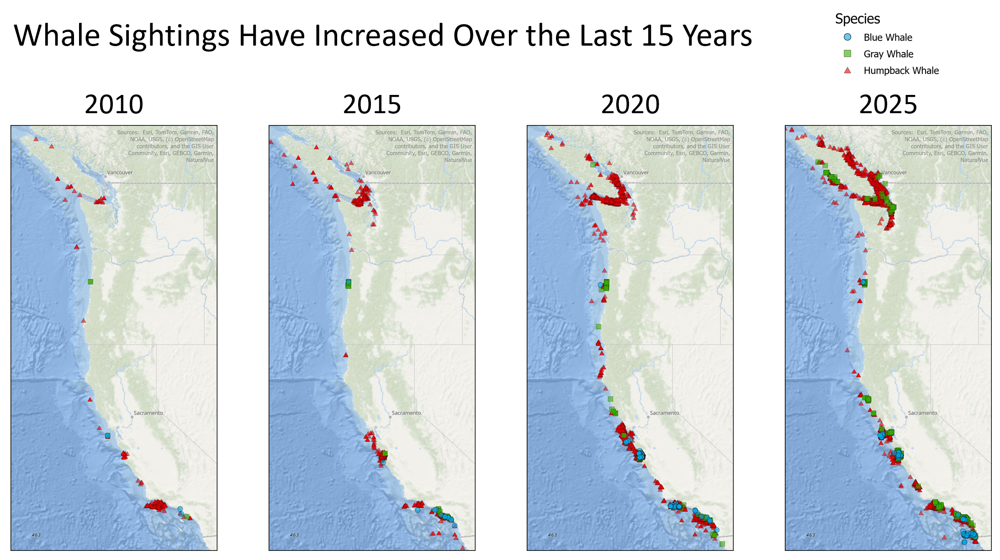
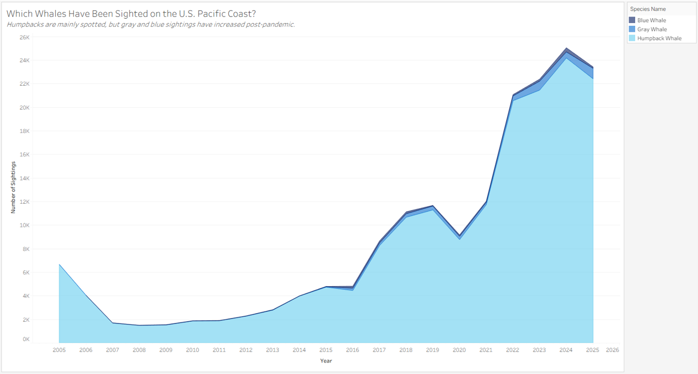
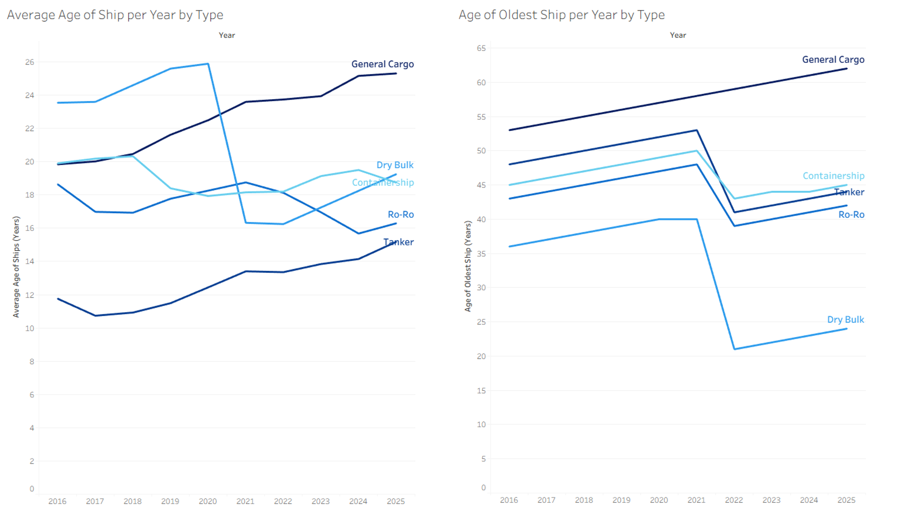
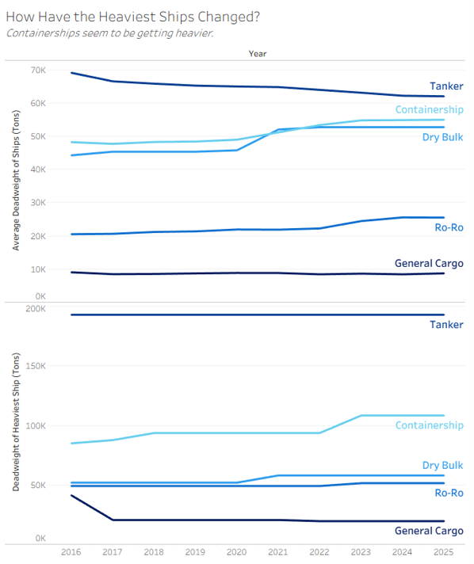

| [Home](https://anna-ringwood.github.io/fa25-dataviz-portfolio/) | [Data Viz Examples](dataviz-examples) | [Critique by Design](critique-by-design) | [Final Project I](final-project-part-one) | [Final Project II](final-project-part-two) | [Final Project III](final-project-part-three) |

# Wireframes / storyboards

For my storyboard, see [this link](https://preview.shorthand.com/wlPbZ7Z7Wfk42DCO).

Draft wireframes are below accompanied by user research.

# User research 

## Target audience

To identify representative individuals, I will ask probing questions before demonstrating my visualizations (e.g., "Do you eat a lot of seafood? Do you know a lot about ocean conservation? Would you like to learn more?"). I hope to reach people who are in close proximity to whales, particularly those who operate/use boats, live on the Pacific Coast, and/or consume seafood. I hope that my story will motivate those who hear/view it to think more deeply about the impact of human behavior on animals and our shared environment, ultimately eliciting a sense of appreciation for whales and a desire to protect their habitat and engage in conservation efforts.

## Interview script
My goals in interviewing others are the following:
* Determine whether the visualizations are low-effort to comprehend by my target audience
* Understand how my use of color might be improved, either for clarifying the story or for increasing aesthetics
* Understand how my textual elements might help enhance the visualizations
* Accommodate a wide range of personal tendencies and preferences when it comes to understanding the visualizations

| Goal | Questions to Ask |
|------|------------------|
|Determine whether the visualizations can be comprehended by my target audience|What is this viz trying to convey?|
|Understand how my use of color might be improved, either for clarifying the story or for increasing aesthetics|Do the colors help you understand the viz, or are they distracting?|
|Understand how my textual elements might help enhance the visualizations|Does the provided text help you understand the viz? Do you think anything should be worded differently, added, or removed?|
|Accommodate a wide range of personal tendencies and preferences when it comes to understanding the visualizations|Is there anything about this visualization that you don't like or would change? Do you have any other final thoughts?|

## Interview findings

Because my story was not fully hashed out (the actual wireframes did not support the story I initially planned), I asked my interview participants about only about my visualizations, not my storyboard. Below, the viz wireframe is presented first, followed by a table of interviewee responses for that viz.

### Wireframe 1

| Questions | Late-50s male, loves seafood and boats | Early-50s female, hates seafood and tries to be environmentally conscious | Early-20s male, hates seafood but likes whales and boats | Early-20s female, tolerates seafood and likes whales |
|-------------------------|--------------------------------|-------------|-------------|-------------|
| **What is this viz trying to convey?** | "That whale sightings have increased. For the geographic area, the humpback is the most populous, I guess?" | "That the number of whale sightings has been growing." | "That whale sightings have increased." | "How much whale sightings have increased over the last 15 years." |
| **Do the colors help you understand the viz, or are they distracting?** | Colors are helpful, also glad that there are different shapes | Helps her understand the concentration of sightings, likes the transparency; blue and green are difficult to discern. | Colors help in differentiating the species, but not much else. | Thinks the colors help and can't think of an alternative way to convey the info; finds shapes unnecessary but not harmful. |
| **Does the provided text help you understand the viz? Do you think anything should be worded differently, added, or removed?** | "I think so, it seems pretty clear." | Text helps. | Text helps. | Text helps. |
| **Is there anything about this visualization that you don't like or would change? Do you have any other final thoughts?** | "When I see a single triangle, is that a single whale sighting?" Had to zoom in to see specific sightings. | None | Maybe it would be helpful to put the actual numbers somewhere? | None |

### Wireframe 2

| Questions | Late-50s male, loves seafood and boats | Early-50s female, hates seafood and tries to be environmentally conscious | Early-20s male, hates seafood but likes whales and boats | Early-20s female, tolerates seafood and likes whales |
|-------------------------|--------------------------------|-------------|-------------|-------------|
| **What is this viz trying to convey?** | "Not sure about the shading for gray and blue whales;" assumes that the total area together is the total number of sightings. | "There's a lot of humpback whales out there wanting to be seen. An impressive sharp increase after 2021." | Thinks there are more gray whale sightings than humpback whale sightings | "The type of whales and the amount of the type of whales that have been sighted on the Pacific." |
| **Do the colors help you understand the viz, or are they distracting?** | They help distinguish the species, but not much else. | "Not distracting." | *Question not asked* | *Question not asked* |
| **Does the provided text help you understand the viz? Do you think anything should be worded differently, added, or removed?** | Text is helpful, but lack of familiarity with the chart type "overrides the help." | Text helps. | *Question not asked* | Text helps. |
| **Is there anything about this visualization that you don't like or would change? Do you have any other final thoughts?** | Trouble interpreting that blue whale sightings aren't 24,000, suggests pie charts. | "Giving \[the viewer\] more longitudinal \[data\] which is telling a different story." | Does not like this one, hasn't seen stacked area charts before. Could try using pie charts. | Does not like this one, but has seen stacked area charts before. "It looks like an iceberg." |

### Wireframe 3

| Questions | Late-50s male, loves seafood and boats | Early-50s female, hates seafood and tries to be environmentally conscious | Early-20s male, hates seafood but likes whales and boats | Early-20s female, tolerates seafood and likes whales |
|-------------------------|--------------------------------|-------------|-------------|-------------|
| **What is this viz trying to convey?** | "Average and oldest ages of ships, both are going longitudinally." | "Ships are getting older." | *No direct answer* | "The average age of ships and the oldest ship age over the years." |
| **Do the colors help you understand the viz, or are they distracting?** | Correspondence between the two graphs helps. | Colors help-- "if they were all the same color, it would be very difficult to follow the lines." | "Colors help because we have intersections." | "The blues aren't different enough." |
| **Does the provided text help you understand the viz? Do you think anything should be worded differently, added, or removed?** | Text helps. | Change "Containership" to "Container" for consistency and maybe helping with the overlap. | Text helps. | Text helps. |
| **Is there anything about this visualization that you don't like or would change? Do you have any other final thoughts?** | Right sub-chart is easier to understand because there's not as much overlap; looks like a bunch of ships were retired (or possibly sank) in 2021. | "How does the average age of an entire fleet of ships drop?" Would move the x-ais "Year" label to the bottom axis. | Prefers this chart the most. "Is it better to use older ships so we don't have to spend resources making new ones?" | "Dry bulk really went down between 2020 and 2021." |

### Wireframe 4

| Questions | Late-50s male, loves seafood and boats | Early-50s female, hates seafood and tries to be environmentally conscious | Early-20s male, hates seafood but likes whales and boats | Early-20s female, tolerates seafood and likes whales |
|-------------------------|--------------------------------|-------------|-------------|-------------|
| **What is this viz trying to convey?** | "Something about the weight of ships changing over time." | "So many of the lines are flat. The weight of ships has not changed over time." | Average and heaviest weights of ships "across a given span of years" | "How the heaviest ships of each type of ship have changed." |
| **Do the colors help you understand the viz, or are they distracting?** | *Question not asked* | *Question not asked* | "Colors help with intersections."| Same comment about blues as previous chart. |
| **Does the provided text help you understand the viz? Do you think anything should be worded differently, added, or removed?** | Subtitle is helpful, maybe Dry Bulk is also increasing, though not as much. | *Question not asked* | Thinks subtitle is too direct and forces the viewer towards a specific conclusion. | Doesn't like that the title is a question.  |
| **Is there anything about this visualization that you don't like or would change? Do you have any other final thoughts?** | "Nope, nothing else." | "The top graph is running into the bottom graph visually." | Leave more gap between the graphs, though prefers side-by-side with a synchronized axis.| None. |

# Identified changes for Part III

Below is a synthesis of my interview research as well as changes I plan on making for part III.

| Research synthesis                       | Anticipated changes for Part III                                                |
|------------------------------------------|---------------------------------------------------------------------------------|
| Stacked area chart was least liked, mainly because it was unfamiliar. | Both male interviewees suggested trying pie charts, so I plan to see at least what that might look like for a select subset of years. Regardless of outcome, I will not be keeping the stacked area chart since my target audience is not as technical. |
| Blue colors were helpful in the line graphs, but more contrast may be needed. | I am going to try more of a blue-green color palette (in keeping with the oceanic theme) to see if contrast improves. |
| Side-by-side line graphs were preferred to vertically-stacked ones. | I will present the graphs side-by-side or maybe even just one at a time, depending on how it looks on the final storyboard. |

Overall, I feel well-equipped to make appropriate changes to my existing figures. The current visualizations were developed before I received feedback on Part I, so before Part III I will also build out my story more to include additional challenges faced by whales (e.g., fishing practices, noises from boats, water pollution, and recycling practices (or lack thereof)). As I make additional figures to augment my story, I will keep my interviewees' feedback in mind and seek out their opinions again if needed.

## References
* Whale sighting data from [OBIS-SEAMAP and Happywhale](https://seamap.env.duke.edu/dataset/1758).
* Ship data from [U.S. DOT Maritime Administration (MARAD)](https://www.maritime.dot.gov/data-reports/data-statistics/vessel-inventory-reports-july-1990)

## AI acknowledgements
AI was used for some Tableau troubleshooting.
